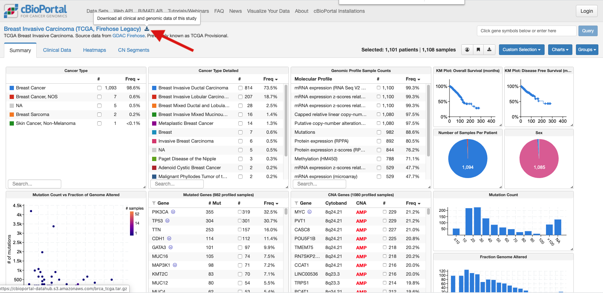

```{r setup, include=FALSE}
knitr::opts_chunk$set(echo = TRUE)
```

## Introduction

This is a tutorial to show how to perform differential expression using TCGA RNA-seq data. It uses the TCGA breast cancer (BRCA) dataset and performs differential expression analysis of HER2 samples using limma-voom. The analysis uses tidyverse and tidybulk packages.

### Acknowledgements
Thanks to Franco Caramia and James McCracken for input on the workflow. And to Stefano Mangiola as this builds on previous tidytranscriptomics workshops. 

### Packages

Load the packages we need.

```{r message = FALSE}
library(readr)
library(tidyr)
library(dplyr)
library(ggplot2)
library(tidybulk)
library(tidySummarizedExperiment)
```

If you need to install the packages you can run below.
```{r eval = FALSE}
if (!requireNamespace("BiocManager"))
    install.packages("BiocManager")
BiocManager::install(c("tidybulk", "tidySummarizedExperiment", "tidyverse"))
```

Set theme for plots
```{r}
# Use colourblind-friendly colours from http://www.cookbook-r.com/Graphs/Colors_(ggplot2)/. Ordered here to have her2_neg grey, her2_low blue and her2_pos yellow
friendly_cols <- c("#56B4E9", "#999999", "#E69F00")

# Set theme
custom_theme <-
  list(
    scale_fill_manual(values = friendly_cols),
    scale_color_manual(values = friendly_cols),
    theme_bw() +
      theme(
        panel.border = element_blank(),
        axis.line = element_line(),
        panel.grid.major = element_line(size = 0.2),
        panel.grid.minor = element_line(size = 0.1),
        text = element_text(size = 12),
        legend.position = "bottom",
        strip.background = element_blank(),
        axis.title.x = element_text(margin = margin(t = 10, r = 10, b = 10, l = 10)),
        axis.title.y = element_text(margin = margin(t = 10, r = 10, b = 10, l = 10)),
        axis.text.x = element_text(angle = 30, hjust = 1, vjust = 1)
      )
  )
```

### Data files

Data was downloaded from https://www.cbioportal.org/study/summary?id=brca_tcga
on June 22nd 2021.

Right at the top of the page, next to ‘Breast Invasive Carcinoma, (TCGA, Firehose Legacy) – there’s a little down pointing arrow (shown in screenshot below), if you press that, you’ll get all the clinical and genomic data.

```{r}

```

Some information on the Firehose Legacy data can be found [here](https://docs.cbioportal.org/1.-general/faq#what-are-tcga-firehose-legacy-datasets-and-how-do-they-compare-to-the-publication-associated-datasets-and-the-pancancer-atlas-datasets)

## Setting up the data

Import the counts file.

```{r message = FALSE}
tcga_rna <- read_tsv("data/brca_tcga/data_RNA_Seq_v2_expression_median.txt")

tcga_rna
```

Convert to long format.

```{r}
tcga_long <- tcga_rna %>%
    pivot_longer(cols=-c(Hugo_Symbol, Entrez_Gene_Id))

tcga_long
```

Import the clinical patient information file. 
Use `comment=` to skip lines starting with #, header lines. Use `guess_max=` some big number greater than the expected number of rows so column types are correctly guessed.

```{r message = FALSE}
tcga_clinical <- read_tsv("data/brca_tcga/data_bcr_clinical_data_patient.txt", comment = "#", guess_max=100000)

tcga_clinical
```

There are a few columns for HER2.

```{r}
tcga_clinical %>% select(contains("HER2")) %>% colnames()
```

We'll use the HER2_IHC_Score and HER2_FISH_STATUS columns. We'll check how mnay samples we've got for each category in these columns.

```{r}
tcga_clinical %>% count(HER2_IHC_SCORE, HER2_FISH_STATUS)
```

We will create a column for the her2 groups of interest. We'll call samples
Her2_pos if HER2_IHC_SCORE = 3 and/or HER2_FISH_STATUS = Positive
Her2_low if HER2_IHC_SCORE = 1 or 2 and HER2_FISH_STATUS = Negative
Her2_neg if HER2_IHC_SCORE = 0

We'll also filter to only keep samples that are in our groups of interest. 
```{r}
groups <- c("HER2_pos", "HER2_low", "HER2_neg")

tcga_her2 <- tcga_clinical %>% 
    mutate(her2_group = case_when((HER2_IHC_SCORE == 3 | HER2_FISH_STATUS == "Positive") ~ "HER2_pos",
                             ((HER2_IHC_SCORE == 1 | HER2_IHC_SCORE == 2) & HER2_FISH_STATUS == "Negative") ~ "HER2_low",
                             HER2_IHC_SCORE == 0 ~ "HER2_neg"
                             )) %>%
    filter(her2_group %in% groups)

tcga_her2
```

To add the her2 group information to the counts table, we need a column to match on that's present in both tables. The counts table has SAMPLE_ID but the patient information has PATIENT_ID. We'll import the sample information table, that has both PATIENT_ID and SAMPLE_ID, and join the patient table to it. Then match to sample id in counts table.

```{r message = FALSE}
tcga_sample <- read_tsv("data/brca_tcga/data_bcr_clinical_data_sample.txt", comment = "#", guess_max=100000)

tcga_sample
```

Keep just sample id and HER2 column to not have too big table. 

```{r}
# Join her2 table to sample table to get sample id
tcga_joined_sample <- inner_join(tcga_her2, tcga_sample, by = "PATIENT_ID") %>% 
    select(SAMPLE_ID, her2_group)

tcga_joined_sample

# Join counts table to her2 status using sample id
tcga_joined <- inner_join(tcga_long, tcga_joined_sample, by = c("name" = "SAMPLE_ID"))

tcga_joined
```

## Exploratory analysis

### Density plots

Create density plots to visualise the distributions of counts for the samples.

```{r}
tcga_joined %>%
    ggplot(aes(x = value + 1, group = name, colour= her2_group)) + 
    geom_density() +
    scale_x_log10() +
    custom_theme
```

The peak on the left shows there are a lot of genes with zero/low counts. We should filter these genes. 

We'll use the tidybulk package to do the RNA-seq filtering and analysis. First we create a tidybulk tibble (table).
```{r}
counts_tt <- tcga_joined %>% 
    mutate(Entrez_Gene_Id = as.character(Entrez_Gene_Id)) %>%
    tidybulk(.sample = name, .transcript = Entrez_Gene_Id, .abundance = value)

counts_tt
```

There are duplicated genes - same symbol, same gene id - don't know why e.g. CC2D2B, id 387707. We'll aggregate these. By default it will sum the counts for these duplicated genes. 

```{r cache = TRUE}
# Note to self - caching this step for the moment in the Rmd as it's slow

counts_dupsrem <- counts_tt %>% aggregate_duplicates()
```

After removing duplicate genes, we'll convert to tidySummarizedExperiment format as that will more efficiently handle this large dataset, will be quicker to process.

```{r}
counts_se <- counts_dupsrem  %>% as_SummarizedExperiment()
```

### Filtering lowly expressed

Now we'll filter low counts. We'll filter using the her2 group information. This uses edgeR filterbyExpr,
```{r}
counts_filtered <- counts_se %>% keep_abundant(factor_of_interest = her2_group)
```

Check density plots.

```{r}
counts_filtered %>%
    ggplot(aes(x = value + 1, group = sample, colour = her2_group)) + 
    geom_density() +
    scale_x_log10() +
    custom_theme
```

Now the peak on the left is gone.


### RLE plots

We'll use RLE plots to check the normalisation. Ref https://journals.plos.org/plosone/article?id=10.1371/journal.pone.0191629

We'll randomly select 50 samples to be able to see the boxplots.

```{r}
# Get 50 samples from distinct values of sample id
num <- 50
sample_ids <- counts_filtered %>% 
  distinct(sample) %>% 
  slice_sample(n=num) %>% 
  pull()

# Extract these samples from the full dataset
counts_subsampled <- counts_filtered %>% filter(sample %in% sample_ids)
```

To create the RLE plots we calculate the median log count for each gene and subtract that from the log count for that gene in each sample.

```{r}
counts_subsampled  %>%
    group_by(feature) %>%
    mutate(gene_median_log = median(log2(value + 1)), 
           rle = log2(value + 1) - gene_median_log) %>%
    ggplot(aes(x=sample, y=rle, fill = her2_group)) + 
    geom_boxplot(outlier.shape = NA) +
    custom_theme
```

### PCA plots

We'll create PCA plots to see how the samples group.

```{r}
#Calculate dimensions
counts_PCA <-
  counts_filtered %>%
  reduce_dimensions(method = "PCA")
```


```{r}
# Plot PCs
counts_PCA %>%
  pivot_sample() %>%
  ggplot(aes(x = PC1, y = PC2, colour = her2_group)) +
  geom_point() +
  custom_theme
```

## Differential expression

We'll perform differential expression with limma-voom. 
We'll compare the HER2_pos to the HER2_neg group.

```{r}
 counts_de <- counts_PCA %>%
    test_differential_abundance(
    ~ 0 + her2_group,
    .contrasts = c("her2_groupHER2_pos - her2_groupHER2_neg"),
    omit_contrast_in_colnames = TRUE,
    method = "limma_voom"
  )

counts_de
```

### P values histogram

Create histogram of P values. Check if histogram of P values looks appropriate. Ref https://www.ncbi.nlm.nih.gov/pmc/articles/PMC6164648/

```{r}
 counts_de %>%    
    pivot_transcript() %>% 
    ggplot(aes(x = P.Value)) +
    geom_histogram(binwidth= 0.01) +
    custom_theme
```

If you want to save the differential expression results table to a file.

```{r eval= FALSE}
 counts_de %>% 
    pivot_transcript() %>% 
    write_tsv("tcga_her2_pos_vs_neg.tsv")
```

Record R and package versions.

```{r}
sessionInfo()
```